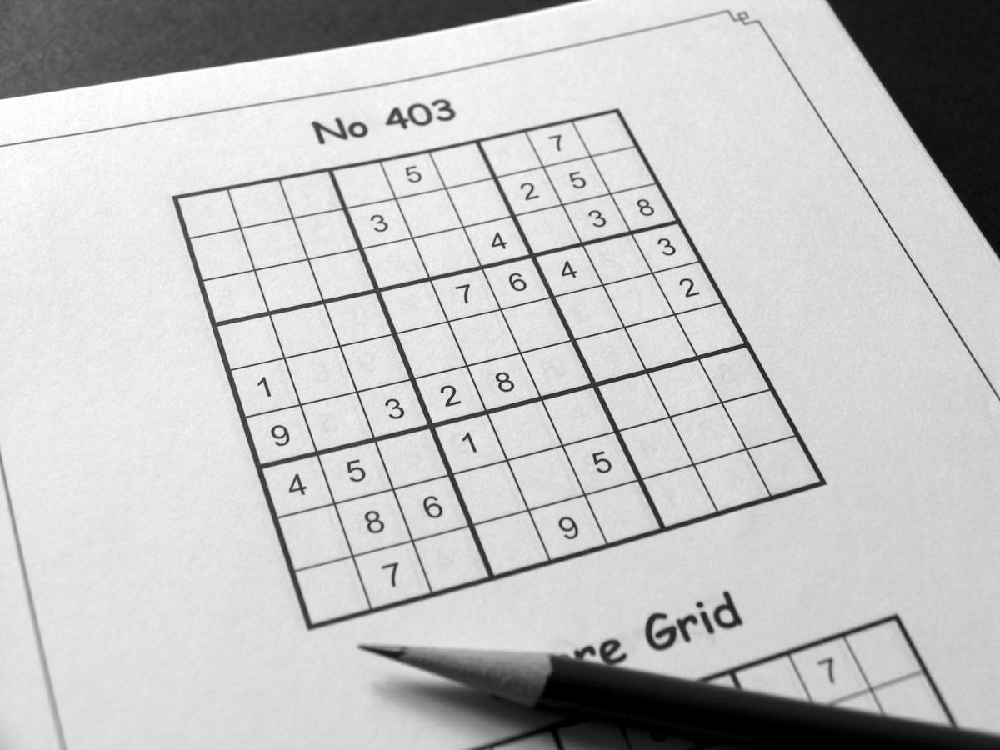
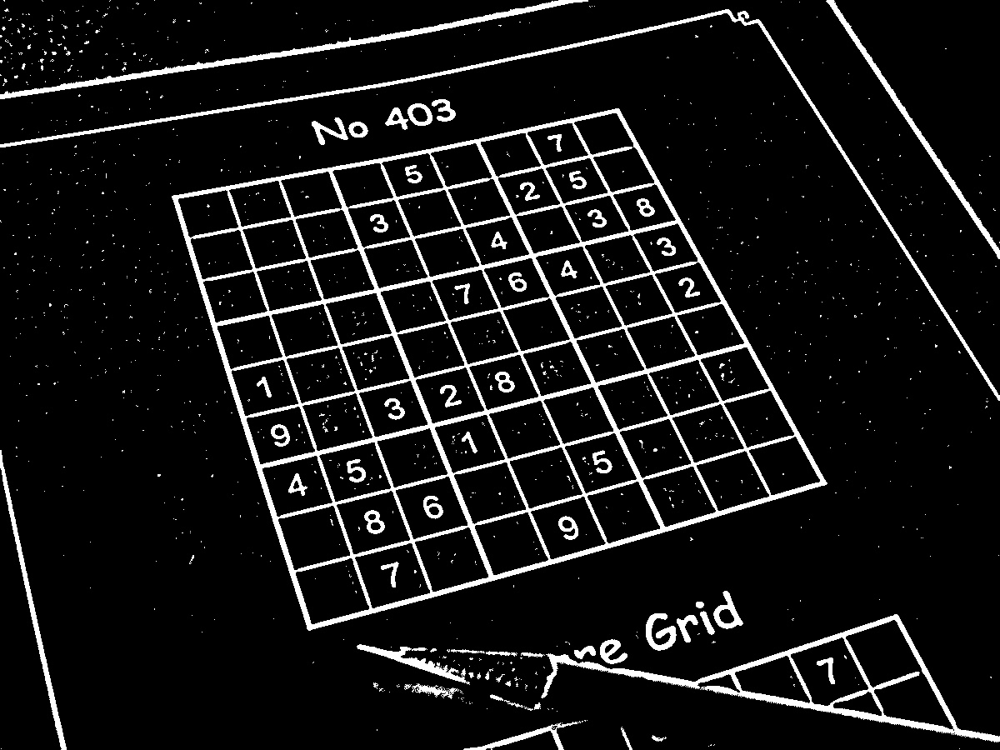
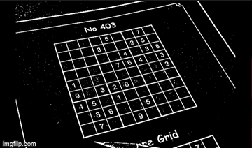
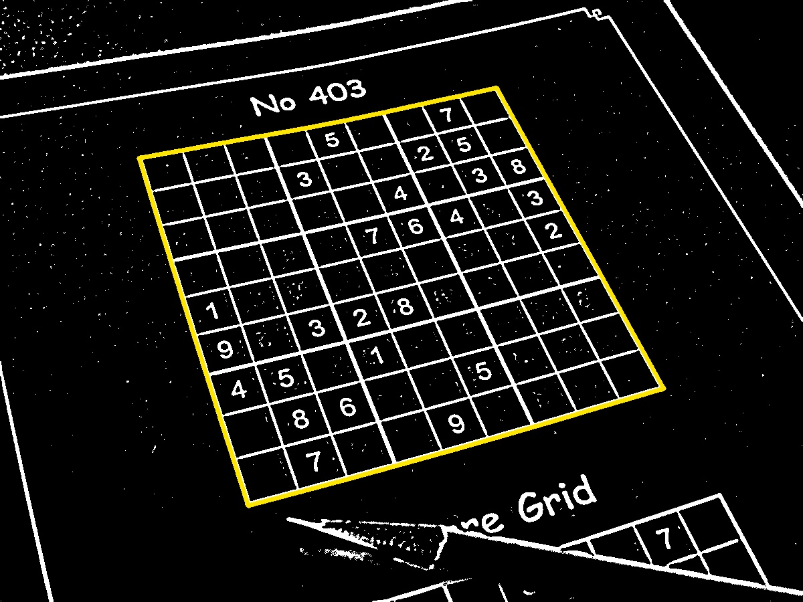
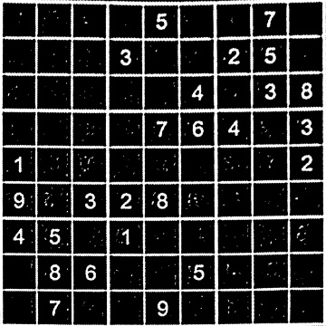
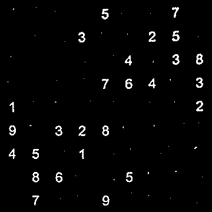
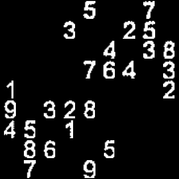
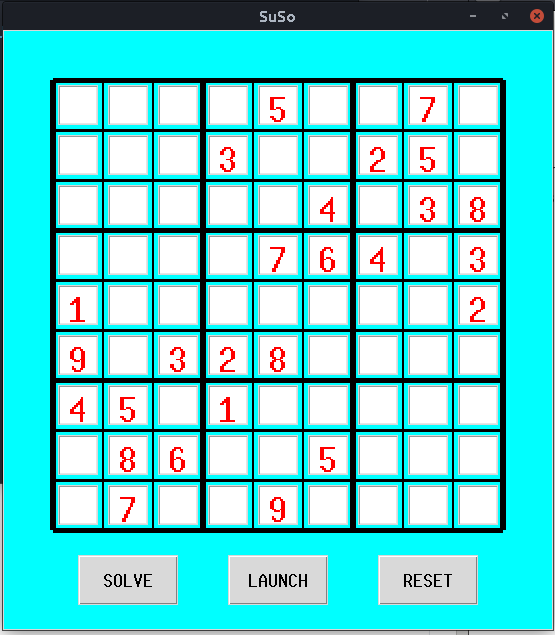
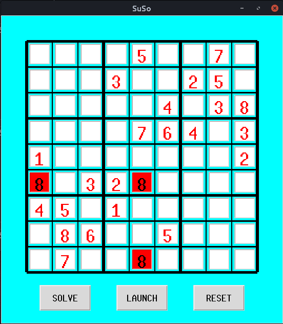
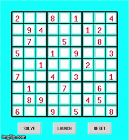

# Su-So
**Sudoku Solver**.

## Project in a nutshell 
While I got my hands dirty on the **Digit classification dataset problem** ,I wondered where could I possibly use it . One idea which hit my head was to solve a sudoku. I could just take a snap of the sudoku from the newspaper and the computer could solve it for me , I learnt that **backtracking** would work well to solve the sudoku but I had to inupt the numbers, which was not at all cool. I also found out that I could build a **Computer Vision** solution to it , which could possibly predict the digits and empty spaces. That's what it all took to start **#Su-So**. Besides that there has been many implementations with this project such as real time projections on the paper. It too didn't hit me interesting. At the end if I could predict the sudoku , I should be able to play with  it as well,
So I built a **GUI** model for it. All it has to do is create a interface for me to solve the sudoku , and when I quit(which is usually the case :) , I would ask the computer to solve it.

A good source was : 
```
https://aishack.in/tutorials/sudoku-grabber-opencv-plot/
```
## Behind the scenes
This is the Sudoku snapshot taken.

<p align="center">

</p>

It's just been denoised using guassian blurring and turned into B&W .
<p align="center">

</p>

Later to find the exact boundaries , I used a ***flood fill algorithm*** which returns the largest connected blob in the snap , which usually the outer edge of the puzzle. This will later help us in determing the perspective transform (in simple words transforming the inclined pic into a neatly alligned pic) , Coz Computer Vision likes neatly alligned images.

In a nutshell , the below is how I used flood fill algorithm : 
***Flood Fill algo in action***
<p align="center">

</p>

The higlighted part is the boundary of the blob found using the above step.
<p align="center">

</p>

By using the boundary we could find the perspective transform to potray the puzzle in a neat form. The below is the result.

<p align="center">

</p>

But don't you think we should also get rid of the inner grid lines.After all we just need to cutout the integer in the square , so we should better clean out those inner grid lines. I wrote a small piece of code which would fill these spots with black .
<p align="center">

</p>

We can decide the presence of a number just by dividing the image into 81 pieces and can check whether it has enough white pixels to contain an element , this is done by providing a therehold value of pixels (e.g; 5*255). Later after finding them out we need to enlarge them out so that they fit the square which are parsed out. \\
For this I implemented a bounding box method , where I return a rectangle bounding the integer and just parse it out leaving the outer portion and then enlarging it to the initial box.The result will be like this. 
<p align="center">

</p>

Now that we have everything we can now parse the rectangles with integers and pass it to a model which predicts digits. 

<p align="center">

</p>

Since now we have the digits to be predicted , I build a CNN model which was trained on MNIST dataset , and that was predicting the parsed out digits from the puzzle. \\

I also built a GUI using python tkinter. Through which the predicted digits will be placed like this.

<p align="center">

</p>

## Play with it ...

There is no kick in finding the solution to a puzzle without getting your hands dirty. So after predicting you would be able to solve the puzzle by placing your inputs in the GUI. If your enter a invalid entry , meaning if it disobey the rules  . **It warns you !!!**. \

Since you have a UI now you need not worry about the dirty scribblings over your newspaper. The red blocks are effected due to a invalid entry
<p align="center">

</p>
Later when you are too bored to solve it , just push the **SOLVE** button, the computer now takes all the burden to solve the puzzle. 

As said earlier I used the **Back tracking Algo** for solving this . The below is a snippet of how it really works. \
**Backtracking in Action **

<p align="center">

</p>


